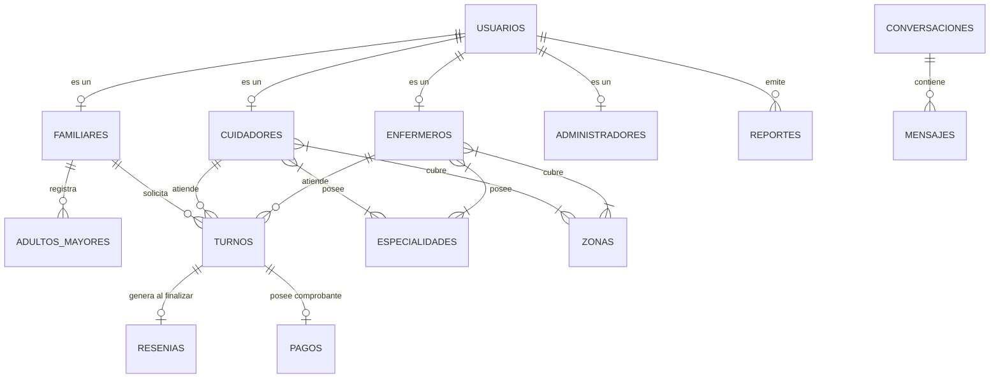

# 🩺 CareConnect — Plataforma Integral de Cuidados Gerontológicos y Enfermería

<p align="center">
  
</p>

<p align="center">
  <b>Conectando familias con cuidadores profesionales y enfermeros matriculados de confianza.</b><br/>
  <i>Plataforma moderna, segura y escalable basada en una arquitectura cliente-servidor desacoplada.</i>
</p>

<p align="center">
  
  
  
  
  
  
  
  
</p>

---

## 📋 Tabla de Contenidos
1. [Resumen del Proyecto](#-1-resumen-del-proyecto)
2. [Arquitectura del Sistema](#%EF%B8%8F-2-arquitectura-del-sistema)
3. [Informe Exhaustivo de Tecnologías](#-3-informe-exhaustivo-de-tecnolog%C3%ADas)
   - [Backend (API RESTful)](#-backend-api-restful)
   - [Frontend (Single Page Application)](#%EF%B8%8F-frontend-single-page-application)
   - [Base de Datos y Persistencia](#-base-de-datos-y-persistencia)
   - [Infraestructura & DevOps](#-infraestructura-y-devops)
4. [Modelo de Datos y Entidades Principales](#-4-modelo-de-datos-y-entidades-principales)
5. [Módulos y Funcionalidades Clave](#-5-m%C3%B3dulos-y-funcionalidades-clave)
6. [Seguridad y Control de Acceso (RBAC)](#-6-seguridad-y-control-de-acceso-rbac)
7. [Cuentas de Prueba y Credenciales](#-7-cuentas-de-prueba-y-credenciales)
8. [Guía de Instalación y Ejecución](#-8-gu%C3%ADa-de-instalaci%C3%B3n-y-ejecuci%C3%B3n)

---

## 📌 1. Resumen del Proyecto

**CareConnect** es una solución tecnológica integral diseñada para resolver la búsqueda, contratación, coordinación y seguimiento de servicios de cuidado domiciliario y atención de enfermería para adultos mayores o pacientes con necesidades terapéuticas.

### Objetivos Principales:
* **Transparencia y Seguridad:** Validación de identidades, matrículas profesionales de enfermería (MN / MP) y antecedentes.
* **Búsqueda Inteligente:** Filtros dinámicos por geolocalización/zonas de cobertura, especialidades geriátricas y tarifas horarias.
* **Gestión Operativa Integral:** Flujo completo de turnos (solicitud, confirmación, seguimiento y finalización).
* **Feedback Confiable:** Sistema de reseñas verificadas vinculado a contrataciones finalizadas con recálculo en tiempo real de métricas y puntuaciones.

---

## 🏛️ 2. Arquitectura del Sistema

La solución implementa una **Arquitectura Desacoplada (Decoupled Single Page Application + RESTful API)** con comunicación a través de HTTPS/JSON y persistencia distribuida en la nube.

```
┌────────────────────────────────────────────────────────┐
│                    CLIENTE WEB (SPA)                   │
│         React 18 + Vite 6 + Tailwind CSS 4             │
│            (Alojado en Vercel CDN Global)              │
└──────────────────────────┬─────────────────────────────┘
                           │
                           │ HTTPS / JSON (JWT Bearer Token)
                           ▼
┌────────────────────────────────────────────────────────┐
│                  BACKEND (API RESTful)                 │
│         Java 21 LTS + Spring Boot 3.2.5 + Spring Sec 6 │
│              (Alojado en Render Cloud Service)         │
│  ┌──────────────────────────────────────────────────┐  │
│  │ Capas: Controller ➔ Service ➔ Repository ➔ Entity│  │
│  └──────────────────────────────────────────────────┘  │
└──────────────────────────┬─────────────────────────────┘
                           │
                           │ JDBC / TLS SSL (HikariCP Connection Pool)
                           ▼
┌────────────────────────────────────────────────────────┐
│             BASE DE DATOS RELACIONAL CLOUD             │
│               TiDB Cloud Serverless                    │
│     (Motor distribuido compatible con MySQL 8.0)       │
└────────────────────────────────────────────────────────┘
```

---

## 🛠️ 3. Informe Exhaustivo de Tecnologías

### ☕ Backend (API RESTful)

| Tecnología / Dependencia | Versión | Rol y Beneficio Técnico |
| :--- | :--- | :--- |
| **Java** | `21 (LTS)` | Versión LTS que incorpora optimizaciones en el compilador, Virtual Threads, Records y Pattern Matching para un rendimiento superior en concurrencia. |
| **Spring Boot** | `3.2.5` | Framework empresarial estándar para la construcción de microservicios y APIs REST robustas, auto-configuración y métricas de salud. |
| **Spring Security** | `6.2.x` | Capa de seguridad perimetral que gestiona autenticación, autorización por roles (RBAC) y políticas CORS. |
| **JJWT (Java JWT)** | `0.12.5` | Generación, firmado criptográfico (HMAC-SHA256) y validación stateless de JSON Web Tokens. |
| **Spring Data JPA / Hibernate** | `6.4.x` | Mapeo objeto-relacional (ORM), persistencia transaccional con `@Transactional` y soporte de herencia relacional (`InheritanceType.JOINED`). |
| **HikariCP** | `5.1.x` | Pool de conexiones JDBC ultrarrápido y liviano que optimiza la reutilización de conexiones hacia la base de datos. |
| **MySQL Connector/J** | `8.x` | Driver oficial de comunicación JDBC con soporte nativo de cifrado SSL/TLS para conexiones en la nube. |
| **Flyway Core & MySQL** | `9.22.x` | Motor de migraciones y versionado incremental de la base de datos (`V1` a `V9`), asegurando integridad de esquemas. |
| **Jakarta Bean Validation** | `3.0.x` | Validación declarativa de DTOs en tiempo de ejecución (`@NotBlank`, `@Email`, `@Min`, `@NotNull`). |
| **Project Lombok** | `1.18.30` | Reducción de código repetitivo (*boilerplate*) mediante anotaciones (`@Getter`, `@Setter`, `@Builder`, `@RequiredArgsConstructor`). |
| **Apache Maven** | `3.9.x` | Gestión de dependencias del ciclo de vida de compilación y empaquetado JAR ejecutable. |

---

### ⚛️ Frontend (Single Page Application)

| Tecnología / Dependencia | Versión | Rol y Beneficio Técnico |
| :--- | :--- | :--- |
| **React** | `18.3.1` | Biblioteca declarativa basada en componentes y React Hooks (`useState`, `useEffect`, `useContext`, `useCallback`). |
| **Vite** | `6.3.5` | Herramienta de compilación ultrarrápida con Hot Module Replacement (HMR) y empaquetado optimizado con Rollup/esbuild. |
| **React Router DOM** | `7.1.3` | Enrutamiento del lado del cliente (*Client-Side Routing*) con protección de rutas privadas basada en roles (`ProtectedRoute`). |
| **Tailwind CSS** | `4.1.12` | Motor de estilos utilitario de alto rendimiento, soporte responsive nativo (*Mobile-First*) y paleta cromática profesional. |
| **Axios** | `1.7.9` | Cliente HTTP basado en promesas con interceptores para inyección de token `Authorization: Bearer` y captura global de errores 401. |
| **Radix UI Primitives** | `^1.1 - ^2.1` | Primitivas de UI accesibles (WAI-ARIA compliant) sin estilos forzados (Dialog, DropdownMenu, Avatar, Select). |
| **Lucide React** | `0.487.x` | Librería de iconos SVG limpios, consistentes y vectoriales. |
| **Sonner & Toasts** | `2.0.3` | Notificaciones flotantes interactivas para confirmaciones de acción y alertas de error. |
| **ESLint** | `9.0.x` | Linter de código estático para garantizar buenas prácticas y detección temprana de errores sintácticos. |

---

### 🗄️ Base de Datos y Persistencia

* **Plataforma:** **TiDB Cloud Serverless** (*Compatible con protocolo y sintaxis MySQL 8.0*).
* **Motor Subyacente:** **TiKV** (Almacenamiento distribuido Key-Value sobre RocksDB con compresión y alta disponibilidad).
* **Estrategia de Mapeo JPA:** `InheritanceType.JOINED` sobre la entidad base `Usuario`, permitiendo tablas especializadas con integridad referencial estricta.

---

### ☁️ Infraestructura y DevOps

* **Control de Versiones:** Repositorios Git en GitHub (`cc-backend` y `cc-frontend`) bajo flujo de ramas `main` (producción) y `develop` (desarrollo).
* **Frontend Hosting:** **Vercel** conectado a GitHub con compilación y despliegue continuo (*CI/CD*) en red CDN global.
* **Backend Hosting:** **Render Web Services** ejecutando contenedor con Java 21 OpenJDK en entorno administrado.
* **Base de Datos Cloud:** **TiDB Cloud AWS** (Región `sa-east-1`).

---

## 📊 4. Modelo de Datos y Entidades Principales



---

## ⚡ 5. Módulos y Funcionalidades Clave

### 1. 🔍 Directorio y Marketplace Público
* Búsqueda en tiempo real con filtros combinables por especialidad, rango de precio, ubicación y tipo de rol profesional (`CUIDADOR` o `ENFERMERO`).
* Perfiles públicos completos con insignias de matrícula profesional verificada, experiencia laboral, valor horario y biografía.

### 2. 📅 Gestión Integral de Turnos
* Flujo guiado de contratación seleccionando adulto mayor a cargo, fecha, horarios y tipo de servicio.
* Ciclo de vida del turno: `PENDIENTE` ➔ `CONFIRMADO` ➔ `FINALIZADO` / `CANCELADO`.

### 3. ⭐ Sistema de Reseñas y Calificaciones
* Calificación de 1 a 5 estrellas y reseña escrita disponible una vez finalizado el servicio.
* Recálculo automático de la puntuación promedio del profesional y actualización instantánea en el marketplace.

### 4. 🤖 Centro de Ayuda Inteligente y Soporte
* Chatbot asistente interactivo para responder dudas de navegación, reservas, pagos y políticas de la plataforma.
* Formulario estructurado para radicar incidentes y reportes de comportamiento.

### 5. 🛡️ Panel de Control y Moderación (`/admin`)
* Supervisión general de métricas operativas de la plataforma.
* Revisión, resolución y respuesta de reportes de soporte e incidentes.
* Gestión y activación/suspensión de perfiles profesionales.

---

## 🔒 6. Seguridad y Control de Acceso (RBAC)

* **Autenticación:** Tokens JWT con expiración de 24 horas y firma criptográfica.
* **Cifrado de Contraseñas:** Algoritmo **BCrypt** con salt criptográfico automático.
* **Matriz de Roles y Permisos:**
  * `FAMILIAR`: Búsqueda en directorio, registro de adultos mayores, solicitud de turnos y calificación de servicios.
  * `CUIDADOR` / `ENFERMERO`: Configuración de perfil profesional, tarifas, zonas de cobertura y aceptación/rechazo de turnos.
  * `ADMIN`: Acceso exclusivo al panel administrativo `/admin`, resolución de reportes y métricas globales.
* **Resiliencia en el Cliente:** Interceptores Axios que capturan respuestas `HTTP 401 (Unauthorized)` por expiración de sesión, limpiando credenciales residuales y redirigiendo al login sin bucles ni fallos de renderizado.

---

## 👥 7. Cuentas de Prueba y Credenciales

Las siguientes cuentas se encuentran sembradas y activas en la base de datos TiDB Cloud para pruebas de evaluación:

| Rol | Nombre | Email | Contraseña | Detalle / Matrícula | Tarifa / Zona |
| :--- | :--- | :--- | :--- | :--- | :--- |
| 🛡️ **ADMIN** | Administrador CareConnect | `admin@careconnect.com` | `AdminPass123!` | Acceso completo a `/admin` | N/A |
| 🩺 **ENFERMERO** | Lic. Sofía Belén Albarracín | `sofia.albarracin@careconnect.com` | `SofiaCare2026!` | Enfermera Matriculada (**MN-84921**) | $6.500/h · Palermo |
| 🩺 **ENFERMERO** | Lic. Clara Inés Benítez | `clara.benitez@careconnect.com` | `ClaraCare2026!` | Enfermera Universitaria (**MP-43209**) | $7.000/h · Recoleta |
| 🤝 **CUIDADOR** | Martín Alejandro Gómez | `martin.gomez@careconnect.com` | `MartinCare2026!` | Acompañante Terapéutico | $4.800/h · Caballito |
| 🤝 **CUIDADOR** | Valentina Rocío Morales | `valentina.morales@careconnect.com` | `ValentinaCare2026!` | Cuidadora Gerontológica Integral | $5.200/h · Belgrano |

---

## 🚀 8. Guía de Instalación y Ejecución

### Prerrequisitos
* **Java 21 JDK**
* **Node.js 18+** y **npm**
* **Maven 3.9+**

### 1. Iniciar el Backend (Spring Boot)
```bash
cd careconnect-backend
mvn spring-boot:run
```
> El servidor iniciará en `http://localhost:8080` conectado a TiDB Cloud.

### 2. Iniciar el Frontend (React + Vite)
```bash
cd careconnect-frontend
npm install
npm run dev
```
> La aplicación estará disponible en `http://localhost:5173`.

---

## 📄 Licencia
Proyecto desarrollado para **CareConnect**. Todos los derechos reservados © 2026.
